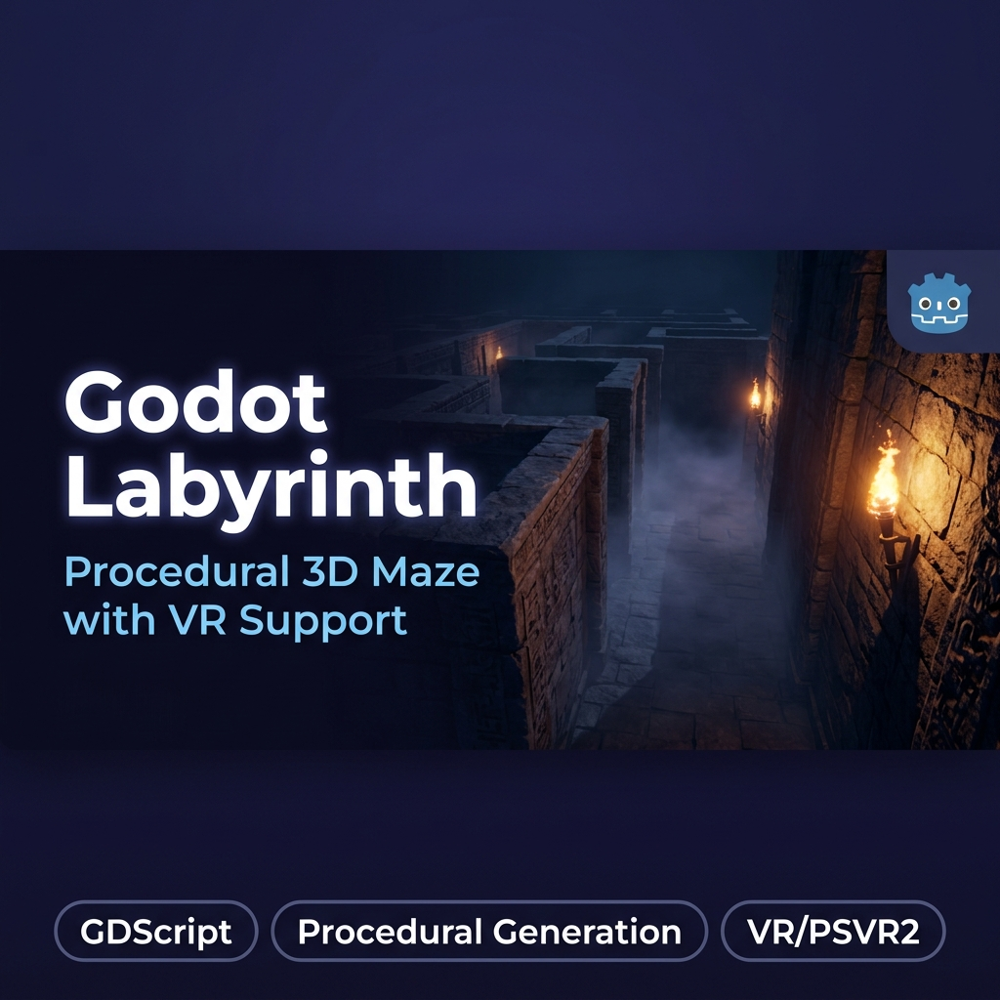

# 🌀 Godot 3D VR Labyrinth



> **Von 0 auf Virtual Reality in unter 5 Stunden** – ein prozedural generiertes 3D-Labyrinth mit Monster-KI, Video-Galerien und nativer PSVR2-Unterstützung, entwickelt mit KI als Co-Architekt.

[](https://godotengine.org/)
[](https://docs.godotengine.org/en/stable/tutorials/scripting/gdscript/)
[](https://www.khronos.org/openxr/)
[](LICENSE)

---

## 🎯 Projektziel

Das primäre Ziel war die vollständige Entwicklung eines **zufallsgenerierten (prozeduralen) 3D-Labyrinths** in einer bisher unbekannten Engine. Es sollte kein statischer Baukasten sein: Jedes Mal, wenn das Spiel startet, würfelt der DFS-Algorithmus ein neues **30×30-Grid** (900 Räume).

Darin integriert:
- 👾 Monster-KI mit vektorbasiertem Grid-Tracking
- 🛗 Begehbare Fahrstühle
- 🎬 Interaktive Video-Galerien mit Proximity-Culling
- 🥽 Native PlayStation VR2 (PC) Integration – stabile 60+ FPS

---

## 🛠️ Tech Stack

| Technologie | Einsatz |
|---|---|
| **Godot 4 Engine** | Open-Source 3D/2D Game Engine, Szenen-Management, Rendering-Pipeline |
| **GDScript** | Spiellogik, prozedurale Map-Generierung, KI-Navigationspunkte |
| **OpenXR** | PSVR2 (PC) Integration, Controller-Tracking, stereoskopisches Rendering |
| **MultiMeshInstance3D** | GPU-Batching von tausenden Wandgeometrien in einen einzigen Draw-Call |

---

## ✨ Features

- **🗺️ Prozedurale Generierung** – Automatisierter Aufbau eines 900-Räume-Grids per Depth-First-Search bei jedem Neustart. Kein Labyrinth ist identisch.
- **👾 Smart Entity Tracking** – Verfolgende Monster *ohne* teure A\*-Pfadfindung. Stattdessen: Vektorpfeil-Caching auf dem generierten Grid-Graphen für konstante O(1)-Lookups.
- **🎬 Video Galerien** – Dynamisch geladene MP4-Videos (In-Game Kinoleinwände). Playback startet nur, wenn der Spieler hinschaut *und* nah genug ist (Proximity-Ressourcen-Culling).
- **🥽 VR-Modus** – 3D Spatial Audio und vollständig kalibrierte Kamerasteuerung für VR-Headsets. Eigenes 3D-HUD-Schild verhindert die Flat-Screen-HUD-Problematik.
- **🗺️ Minimap UI** – Live-Karte des generierten Labyrinths mit Spielerposition.
- **⚙️ Settings Manager** – In-Game Einstellungsmenü für Auflösung, Render-Skalierung und VR-Optionen.

---

## 🚀 Schnellstart

### Voraussetzungen

- [Godot 4.x](https://godotengine.org/download/) (mit .NET oder ohne)
- Für VR: PlayStation VR2 Adapter (PC-Version) + OpenXR-kompatibler Treiber (z.B. SteamVR)
- Videos für die Galerien (MP4, AV1-codiert empfohlen – siehe unten)

### Starten (Desktop)

```bash
# Projekt in Godot öffnen:
# File → Open Project → diesen Ordner auswählen

# Oder per Batch-Datei:
start.bat
```

### Starten (VR)

```bash
start_vr.bat
```

---

## 📁 Projektstruktur

```
DemoGdotLabyrith/
├── MazeGenerator.gd        # Kernlogik: DFS-Generierung, MultiMesh-Aufbau, Monster-Spawning
├── Player.gd               # Spieler-Controller (Desktop + VR)
├── Monster.gd              # Monster-KI mit Grid-basiertem Tracking
├── Elevator.gd             # Fahrstuhl-Logik
├── SettingsManager.gd      # In-Game Einstellungen
├── VideoAudioProximity.gd  # Proximity-basiertes Video/Audio-Culling
├── MinimapUI.gd            # Live-Minimap
├── DamageVignette.gd       # Visueller Schadens-Effekt
├── main.tscn               # Haupt-Spielszene
├── startup.tscn            # Ladebildschirm
├── gallery/                # Statische Bildgalerie-Assets
├── gallery_video/          # MP4-Videos für In-Game Kinos
├── textures/               # Wand-, Boden-, Deckentexturen
├── audio/                  # Ambient Sound & Effekte
└── docs/                   # Dokumentations-Assets
```

---

## 🧠 KI als Co-Architekt: Lessons Learned

Dieses Projekt wurde als **KI Rapid Prototyping Experiment** konzipiert. Die KI (Claude / Gemini) übernahm die Rolle eines erfahrenen Godot-Architekten – ich die des Orchestrators.

### Performance-Krise: 15 FPS → 60+ FPS

Das kritischste Problem trat auf, als das Spiel massiv zu ruckeln anfing. Bei der Instanziierung von tausenden Räumen brach die Leistung auf **15 FPS** ein.

**Symptom-Beschreibung an die KI:**
> *„FPS droppen auf 15, GPU-Last ist dennoch minimal, CPU ist beschäftigt. Ich nutze tausende Einzel-Instanzen für StaticBodies der Wände."*

**Lösung:** Die KI empfahl sofort das **MultiMeshInstance3D-Architektur-Pattern**. Durch das Bündeln (Batching) von tausenden Geometrien in *einen einzigen* GPU-Draw-Call stiegen die FPS zurück auf stabile **60+**.

### Video Playback: Grüne Artefakte

Die In-Game Videoplayer froren das Bild mit kaputten grünen Rechtecken ein – ein klassischer Godot-Theora-Makroblock-Bug.

**Lösung:** Neukonvertierung der Videos als rohe Keyframes **ohne** Frame-Interpolation und Thumbnail-Timestamps. Details: [`GODOT_THEORA_MACROBLOCK_FIX_DOCUMENTATION.md`](GODOT_THEORA_MACROBLOCK_FIX_DOCUMENTATION.md)

### VR Motion Sickness

Ursprünglich las der Code Mauseingaben ein. Beim Wechsel auf VR summierte sich die Headset-Drehbewegung mit der Joystick-Bewegung → Motion Sickness und überdrehte Kamera-Achsen. Die Lösung war die strikte **Trennung der Input-Modi** auf Basis des XR-Interface-Status.

---

## 🎬 Video-Assets einrichten

Videos für die In-Game Galerien müssen korrekt codiert sein:

```powershell
# Setup-Skript ausführen:
.\setup_videos.ps1
```

Empfohlene Kodierung (FFmpeg):
```bash
ffmpeg -i input.mp4 -c:v libtheora -q:v 7 -c:a libvorbis -q:a 4 output.ogv
```

> **Hinweis:** Videos **ohne** B-Frames und ohne Thumbnail-Streams konvertieren, um den Godot Theora Makroblock-Bug zu vermeiden.

---

## 🔗 Links

- 📖 **Blog Post (Entwicklungsbericht):** [tnickel-ki.de/blog-godot.html](https://tnickel-ki.de/blog-godot.html)
- 🏠 **Portfolio:** [tnickel-ki.de](https://tnickel-ki.de)
- 👤 **Autor:** Thomas Nickel

---

## 📄 Lizenz

MIT License – siehe [LICENSE](LICENSE) für Details.
